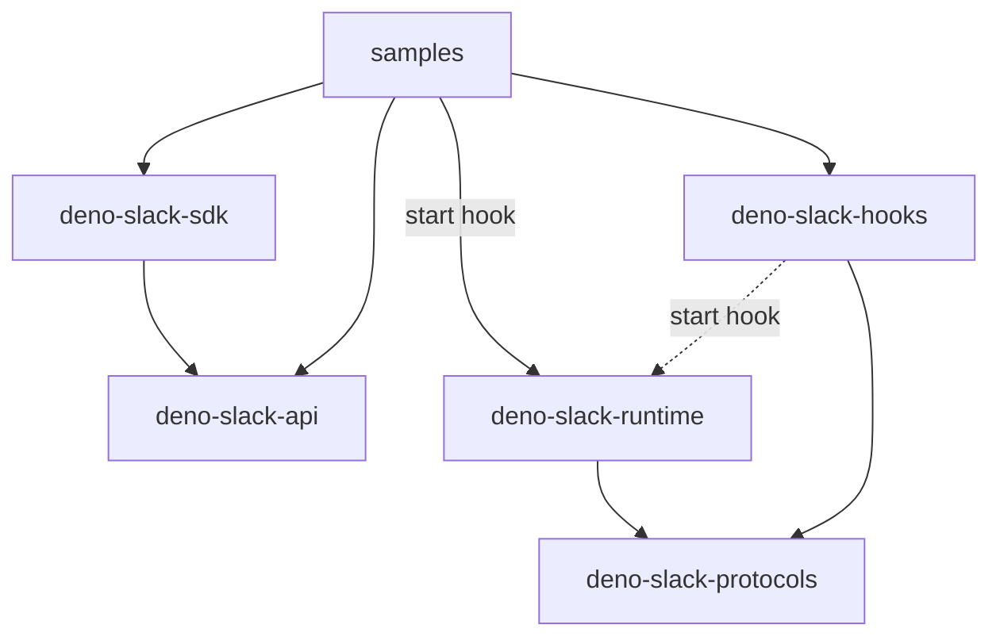

# Maintainers Guide

This document describes tools, tasks and workflow that one needs to be familiar with in order to effectively maintain
this project. If you use this package within your own software as is but don't plan on modifying it, this guide is
**not** for you.

## Tools

All you need to work on this project is a recent version of [Deno](https://deno.land/)

<details>
  <summary>Note</summary>

* You can set up shell completion by following the [Shell Completion](https://deno.land/manual/getting_started/setup_your_environment#shell-completions) guidelines.

</details>

## Tasks

### Testing with Deno

In-code tests can be run directly with Deno:

  ```zsh
  deno task test
  ```

You can also run a test coverage report with:

  ```zsh
  deno task coverage
  ```

### Testing with a sample app

Sometimes you may need to test out changes in this SDK with a sample app or project.

A modified SDK version can be used by updating the `deno-slack-sdk` import url in the app's `import_map.json` file.

> After making changes to your imports, you may need to [reload your modules](https://deno.land/manual@v1.29.1/basics/modules/reloading_modules) in case they've been cached.

#### Using local changes

To use your own code as the SDK, change the import url to the `src/` directory of your local `deno-slack-sdk` repo:

```json
{
  "imports": {
    "deno-slack-sdk/": "../../tools/deno-slack-sdk/src/",
    "deno-slack-api/": "https://deno.land/x/deno_slack_api@1.5.0/"
  }
}
```

#### With remote changes

To test with changes on a remote repo, commit your intended history to a remote branch and note the full commit SHA. (e.g. `fc0a0a1f0722e28fecb7782513d045522d7c0d6f`).

Then in your sample app's `import_map.json` file, replace the `deno-slack-sdk` import url with:

```json
{
  "imports": {
    "deno-slack-sdk/": "https://raw.githubusercontent.com/slackapi/deno-slack-sdk/<commit-SHA-goes-here>/src/",
    "deno-slack-api/": "https://deno.land/x/deno_slack_api@1.5.0/"
  }
}
```

### Lint and format

The linting and formatting rules are defined in the `deno.jsonc` file, your IDE can be set up to follow these rules:

1. Refer to the [Deno Set Up Your Environment](https://deno.land/manual/getting_started/setup_your_environment) guidelines to set up your IDE with the proper plugin.
2. Ensure that the `deno.jsonc` file is set as the configuration file for your IDE plugin
   * If you are using VS code [this](https://deno.land/manual/references/vscode_deno#using-a-configuration-file) is already configured in `.vscode/settings.json`

#### Linting

The list of linting rules can be found in [the linting deno docs](https://lint.deno.land/).
Currently we apply all recommended rules.

#### Format

The list of format options is defined in the `deno.jsonc` file. They closely resemble the default values.

### Update latest SDK dependencies

Check if the Deno related [slack samples](slack-samples) reference the latest versions of their dependencies.

This usually involves updating multiple repositories ([dependency graph](#dependency-graph)), so take a deep breath, relax, and take your time as you run through the following steps, working backwards from the template dependencies up to the [slack samples](slack-samples) themselves:

* There are two **main developer-facing Deno SDK dependencies** that samples rely on:
  [deno-slack-sdk][deno-slack-sdk] and [deno-slack-api][deno-slack-api]. Do either of these repos require new releases? Check:
  * [deno-slack-api][deno-slack-api]: Did any commits land in this repository since its last released tag? If so, a new [deno-slack-api][deno-slack-api] release is required. Follow [the deno-slack-api releasing steps](https://github.com/slackapi/deno-slack-api/blob/main/.github/maintainers_guide.md#releasing).
  * If a new release for [deno-slack-api][deno-slack-api] is required, after releasing new version of [deno-slack-api][deno-slack-api], a dependency change is required for [deno-slack-sdk][deno-slack-sdk]:
    * [deno-slack-sdk's `src/deps.ts`](https://github.com/slackapi/deno-slack-sdk/blob/main/src/deps.ts) needs
      an update to point to this latest [deno-slack-api][deno-slack-api] version. See example PR [here](https://github.com/slackapi/deno-slack-sdk/pull/118).
  * [deno-slack-sdk][deno-slack-sdk]: Did any commits land in this repository since its last released tag? If so, a new [deno-slack-sdk][deno-slack-sdk] release is required. Follow [the deno-slack-sdk releasing steps](#releasing).

* There are also **two additional Deno SDK dependencies the Slack CLI relies on** we should ensure are up to date. These are listed in the templates' `slack.json` file. Typically, this file references the latest released version of [deno-slack-hooks](https://github.com/slackapi/deno-slack-hooks). However, [deno-slack-hooks](https://github.com/slackapi/deno-slack-hooks) itself relies on one other project: [deno-slack-runtime][deno-slack-hooks]. As such, this exercise involves ensuring the latest commits in these two dependent repositories are up-to-date and released.
  Let's start from the end of the chain and work our way backwards:
  * Let's begin with [deno-slack-runtime][deno-slack-hooks]:
    * Did any new commits land in this repo since its last tag? If so, a new release is required. See [the deno-slack-runtime releasing steps](https://github.com/slackapi/deno-slack-runtime/blob/main/.github/maintainers_guide.md#releasing).
    * Does [deno-slack-hooks' `src/libraries.ts`](https://github.com/slackapi/deno-slack-hooks/blob/main/src/libraries.ts)
      `VERSIONS` map reference the latest release of [deno-slack-runtime][deno-slack-hooks]?
      If not, then [deno-slack-hooks' `src/libraries.ts`](https://github.com/slackapi/deno-slack-hooks/blob/main/src/libraries.ts) needs an update to point to this latest release (_Note: We will update [deno-slack-hooks](https://github.com/slackapi/deno-slack-hooks) all at once in a few steps_).
  * Half-way there! Now let's look at [deno-slack-hooks](https://github.com/slackapi/deno-slack-hooks):
    * Does [deno-slack-hooks' `src/libraries.ts`](https://github.com/slackapi/deno-slack-hooks/blob/main/src/libraries.ts)
      `VERSIONS` map reference the latest release of [deno-slack-runtime][deno-slack-hooks]? If not, update those and commit to `main`!
    * Did any new commits land in this repo since its last tag? If so, a new release is required. See the [deno-slack-hooks releasing steps](https://github.com/slackapi/deno-slack-hooks/blob/main/.github/maintainers_guide.md#releasing) for details on how to do this.

### Releasing

Releases for this library are automatically generated off of git tags. Before creating a new release, ensure that everything on the `main` branch since the last tag is in a releasable state! At a minimum, [run the tests](#testing).

To create a new release:

1. Create a new GitHub Release from the [Releases page](https://github.com/slackapi/deno-slack-sdk/releases) by clicking the "Draft a new release" button.
2. Input a new version manually into the "Choose a tag" input. You can start off by incrementing the version to reflect a patch. (i.e. 1.16.0 -> 1.16.1)

     * After you input the new version, click the "Create a new tag: x.x.x on publish" button. This won't create your tag immediately.
     * Auto-generate the release notes by clicking the "Auto-generate release notes" button. This will pull in changes that will be included in your release.
     * Flip to the preview mode and review the pull request labels of the changes included in this release (i.e. `semver:minor` `semver:patch`, `semver:major`). Tip: Your release version should be based on the tag of the largest change, so if this release includes a `semver:minor`, the release version in your tag should be upgraded to reflect a minor.
     * Ensure that this version adheres to [semantic versioning][semver]. See [Versioning](#versioning-and-tags) for correct version format. Version tags should match the following pattern: `1.0.1` (no `v` preceding the number).

3. Set the "Target" input to the "main" branch.
4. Name the release title after the version tag.
5. Make any adjustments to generated release notes to make sure they are accessible and approachable and that an end-user with little context about this project could still understand.
6. Publish the release by clicking the "Publish release" button!
7. After a few minutes, the corresponding version will be available on <https://deno.land/x/deno_slack_sdk>.

## Workflow

### Versioning and Tags

This project is versioned using [Semantic Versioning][semver].

### Branches

> Describe any specific branching workflow. For example:
> `main` is where active development occurs.
> Long running branches named feature branches are occasionally created for collaboration on a feature that has a large scope (because everyone cannot push commits to another person's open Pull Request)

<!--
### Issue Management

Labels are used to run issues through an organized workflow. Here are the basic definitions:

*  `bug`: A confirmed bug report. A bug is considered confirmed when reproduction steps have been
   documented and the issue has been reproduced.
*  `enhancement`: A feature request for something this package might not already do.
*  `docs`: An issue that is purely about documentation work.
*  `tests`: An issue that is purely about testing work.
*  `needs feedback`: An issue that may have claimed to be a bug but was not reproducible, or was otherwise missing some information.
*  `discussion`: An issue that is purely meant to hold a discussion. Typically the maintainers are looking for feedback in this issues.
*  `question`: An issue that is like a support request because the user's usage was not correct.
*  `semver:major|minor|patch`: Metadata about how resolving this issue would affect the version number.
*  `security`: An issue that has special consideration for security reasons.
*  `good first contribution`: An issue that has a well-defined relatively-small scope, with clear expectations. It helps when the testing approach is also known.
*  `duplicate`: An issue that is functionally the same as another issue. Apply this only if you've linked the other issue by number.

**Triage** is the process of taking new issues that aren't yet "seen" and marking them with a basic
level of information with labels. An issue should have **one** of the following labels applied:
`bug`, `enhancement`, `question`, `needs feedback`, `docs`, `tests`, or `discussion`.

Issues are closed when a resolution has been reached. If for any reason a closed issue seems
relevant once again, reopening is great and better than creating a duplicate issue.
-->

## Dependency Graph
<!-- https://mermaid.js.org/syntax/flowchart.html -->
<!-- Link in mermaid are not supported on github https://github.com/mermaid-js/mermaid/issues/3077 -->


| Links |
| :----: |
|[samples][slack-samples]|
|[deno-slack-sdk][deno-slack-sdk]|
|[deno-slack-api][deno-slack-api]|
|[deno-slack-runtime][deno-slack-runtime]|
|[deno-slack-hooks][deno-slack-hooks]|
|[deno-slack-protocols][deno-slack-protocols]|
  
## Everything else

When in doubt, find the other maintainers and ask.

[semver]: http://semver.org/
[slack-samples]: https://github.com/slack-samples?q=&type=public&language=typescript&sort=
[deno-slack-sdk]: https://github.com/slackapi/deno-slack-sdk
[deno-slack-api]: https://github.com/slackapi/deno-slack-api
[deno-slack-runtime]: https://github.com/slackapi/deno-slack-runtime
[deno-slack-hooks]: https://github.com/slackapi/deno-slack-hooks
[deno-slack-protocols]: https://github.com/slackapi/deno-slack-protocols
