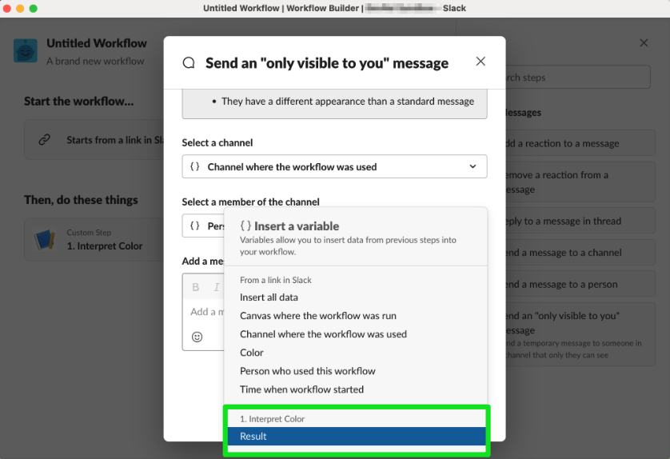
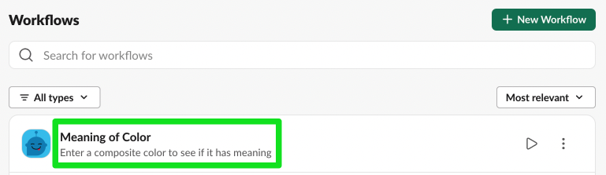
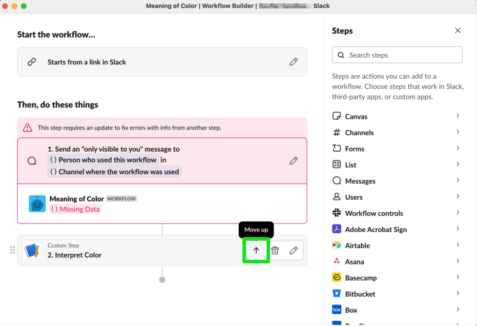

# Create a custom step for Workflow Builder with the Deno Slack SDK

<PaidPlanBanner />

Custom functions in apps can be added as workflow steps in Workflow Builder.

In this tutorial, you will define and implement a [custom function](/deno-slack-sdk/guides/creating-custom-functions), then wire it up as a workflow step in our no-code automation platform [Workflow Builder](https://slack.com/help/articles/360035692513-Guide-to-Workflow-Builder).

When finished, you'll be ready to build custom, scalable functions for anyone using Workflow Builder in your workspace.

You'll build three things in this tutorial:

- A custom function
- A workflow app
- A workflow in Workflow Builder

The custom function will take a user-supplied string—the name of a composite color—and use a switch statement to return a new string—the meaning of the color—based on its value. The function will collect the input string from the user once the workflow is started, then return the result to the user in the form of an ephemeral message. An _ephemeral_ message in Slack is one that is only visible to the user.

:::info

To protect your organization, external users (those outside your organization connected through Slack Connect) cannot use a workflow that contains connector functions built by your organization. This may manifest in a `home_team_only` warning. Refer to [this help center article](https://slack.com/help/articles/14844871922195-Slack-administration--Manage-workflow-usage-in-Slack-Connect-conversations#enterprise-grid-1) for more details.

:::


:::tip[Skip to the code]

If you'd rather skip the tutorial and just head straight to the code, create a new app and use our [function sample](https://github.com/slack-samples/deno-function-template) as a template. The sample custom function provided in the template will be a good place to start exploring!

:::

### The road ahead

1. We'll sketch out what we want the function to do and how users will integrate it in their workflows.
2. You'll write the custom function and deploy the app so you can use the step in Workflow Builder.
3. You'll find the workflow step in Workflow Builder and use it as a step in a workflow that you can run from inside Slack.

Ready? Let's get started!

## Install & authorize the Slack CLI

>Have you installed the CLI? Are you authorized in a workspace? If you answered 'yes' to both questions, skip this step!

You'll need to have the Slack CLI **installed** and **authorized** to begin this tutorial. If you need help, follow the [Quickstart](/deno-slack-sdk/guides/getting-started) guide and you'll be ready to build.

You'll also need a development workspace where you have permission to install apps. Please note that the features in this tutorial require that the workspace be part of a [paid Slack plan](https://slack.com/pricing).

## Create a new app

When you deploy custom functions for Workflow Builder, users will be able to search for your deployed app and then include any steps you've provided for them.

Let's get our new app project started so we can define and then implement our custom function.

With your CLI authorized, go to your terminal and create a new app with the blank template:

1. Run the command `slack create meaning-of-color`. This will tell the CLI you want to create a new workflow app named `meaning-of-color`.

2. When prompted to select a template to build from, select the **Blank template**.

3. When the CLI is finished setting up your project, follow the instructions in your terminal to `cd` into your project's directory.

:::tip[VS Code]

If you're using VS Code, once you `cd` into your project's
directory, open it up with VS code by executing `code .`.

:::

## Create a new custom function

Create a new folder called `functions`.

In the `functions` folder, create a new file called `interpret_color.ts` where you'll will define and implement a custom Slack function.

Start the file off by importing the necessary modules:

```javascript
import { DefineFunction, Schema, SlackFunction } from "deno-slack-sdk/mod.ts";
```

Next, define a new custom function named `InterpretColorFunction`. It should have a single string as both an input and output parameter:

```javascript
export const InterpretColorFunction = DefineFunction({
  callback_id: "interpret_color_function",
  source_file: "functions/interpret_color.ts",
  title: "Interpret Color",
  input_parameters: {
    properties: {
      input_string: {
        type: Schema.types.string,
      },
    },
    required: ["input_string"],
  },
  output_parameters: {
    properties: {
      result: {
        type: Schema.types.string,
      },
    },
    required: ["result"],
  },
});
```

The `title` property will be used to identify this function for users in Workflow Builder.

With the function defined, the next step is to implement it. This function will take the `input_string` and run it through a switch statement, then return a new string based on the matching case:

```javascript
export default SlackFunction(
  InterpretColorFunction,
  ({ inputs }) => {
    const input_string = inputs.input_string;

    switch (input_string) {
      case "orange":
        return {
          outputs: {
            input_string,
            result: "Orange is the color of ambition",
          },
        };
      case "green":
        return {
          outputs: {
            input_string,
            result: "Green is the color of collaboration",
          },
        };
      case "purple":
        return {
          outputs: {
            input_string,
            result: "Purple is the color of harmony",
          },
        };
      default:
        return {
          outputs: {
            input_string,
            result: "That's not a color I recognize",
          },
        };
    }
  },
);
```

The function is aware of three composite colors: orange, green, and purple. If a user supplies one of those composite colors as input, the function will return a fun meaning of that color. If the user supplies a color that is not known (i.e., not orange, green, or purple), then they'll get the default case message.

In every return statement, the function includes both the required output (the `result` string) as well as the original input (the `input_string` string), which is not a required output parameter. This is a design decision that you can make depending on your use case; include the inputs in the return value if you want them available as inputs in follow-on workflow steps.

## Configure the app's manifest

Your app's manifest is where you configure which functions your app should care about, among other things. To do that, import your custom function and add it to your manifest's `functions` property.

Start by opening `manifest.ts` and importing `InterpretColorFunction`:

```javascript
import { Manifest } from "deno-slack-sdk/mod.ts";

// Add this:
import { InterpretColorFunction } from "./functions/interpret_color.ts";
```

Next, configure your app's manifest. For this tutorial, update the `name`, `description`, and `functions` property:

```javascript
export default Manifest({
  name: "Meaning of Color App",
  description: "The meaning of colors",
  icon: "assets/default_new_app_icon.png",
  functions: [InterpretColorFunction],
  workflows: [],
  outgoingDomains: [],
  botScopes: ["commands", "chat:write", "chat:write.public"],
});
```

This app is now finished!

In the next section, you'll start a local development server and test drive the app before deploying it for your users.

## Start the local development server

Start a local development server with `slack run`.

Since this is the first time starting the local development server for this project, you'll be prompted to choose a local environment. The local environment is the Slack workspace you will be using to interact with the app you're currently developing.

Select the option to install to a new workspace, then select the workspace you want to use for development.

Once your local development server has started, you'll see it says `Connected, awaiting events` in your terminal window.

At this point, you're ready to build a workflow in Workflow Builder to test your custom function.

**Keep your local development server running while building the workflow!**

## Use the workflow step in Workflow Builder

In the workspace you just installed your app, open up Workflow Builder and create a new workflow:

1. From your desktop, click your workspace name in the top left.
2. Select **Tools** from the menu, then click **Workflow Builder**. This will open a new window titled "Workflow Builder."
3. In the "Workflow Builder" window that just opened, click the **Create Workflow** button in the top right.

You can also find this screen by navigating to the left-side nav menu in Slack and clicking the elipses **...More** tile, then selecting **Automations**.

There are many ways to start a workflow in Workflow Builder. For this tutorial, we will use a link trigger. Under **Start the workflow...**, select **Choose an event**, then select **From a link in Slack**:


A modal will appear that show you an example **workflow link** (more on that soon) along with a scrollable container that reveals a **Custom inputs** section. Click the **Add Input** button.

:::info

Depending on which Slack plan you are on, the latest version of Workflow Builder may still be rolling out and your UI may appear differently. If you do not see an **Add Input** button, we recommend skipping to the code and using our [function sample](https://github.com/slack-samples/deno-function-template) as a template.

:::


After clicking the **Add Input** button, a form will appear. Use this form to describe the required input parameter for your custom function—i.e., the `color` to interpret. When you're done, click the **Done** button:


After clicking **Done**, the form will disappear and you'll see the custom input you just defined listed above the **Add Input** button. Since your custom function only has one required input, you can now click the **Continue** button to start building the workflow:


You'll now be editing your workflow. The only thing configured right now is the trigger that will start your workflow. Recall that this workflow ought to do two things: run the custom function to get the result of the color interpretation, then send an ephemeral message to the user who ran the workflow.

To add your custom function as a step in this workflow, search for the name of the function ("Interpret Color") in the right-hand **Steps** sidebar:


In the search results that appear in the right-hand sidebar, you should see the name of your app ("Meaning of Color App") along with "(local)", which indicates that this function is provided via your local development server at this time, followed by your "Interpret Color" function. Click on the **Interpret Color** function to begin adding it to your workflow:


As soon as you click on your function to add it to your workflow, you'll be presented with a modal prompting you for an **Input String**. This is your custom function's required input parameter, so pass in the custom input you configured earlier when first creating this workflow. To do that, click on the curly braces icon to the right of the text box labelled "Input String", then select **Color** from the dropdown.

When you're finished, click **Save** to go back to editing your workflow:


Your function—along with the input configuration you set up—is now the first step in the workflow following the trigger. The last thing this workflow needs to do is send an ephemeral message to the user that started it.

In the **Steps** sidebar on the right, click **Messages**:


This brings up built-in functions for common Slack messaging that you can use as steps in your workflow.

Select **Send an "only visible to you" message**, which sends an ephemeral message to a user that only they can see:


After you select **Send an "only visible to you" message**, a modal will appear where you can configure this step.

For **Select a channel**, choose the option **Channel where the workflow was used**.

For **Select a member of the channel**, choose the option **Person who used this workflow**.

For the **Add a message** field, select the **Insert a variable** link below the textbox:


In the **Insert a variable** menu that appears, select the **Result** option located in your custom function's output variable group.



When you're done, **Save** this step to return to the workflow editor:


The workflow is almost ready. The last thing to do before publishing it is configure its name. Click on **Untitled Workflow** at the top to open the **Workflow Details** modal:


In the **Workflow Details** modal, edit the **Name** and **Description** of your workflow. These are what the user will see when the workflow is shared with them. When you're done, click the **Save** button:


Begin publishing your workflow by clicking the **Finish Up** button at the top:


In the **Finish Up** modal, confirm your workflow's name and description, then scroll down to see **Workflow managers**. If you want to add a workflow  collaborator, you can do this here. Scroll down to click **Show more permissions**. This is where you may edit your workflow's permissions:


Let's leave everything as is, and finally, click **Publish**:


**Your workflow has been published!**

## Run your workflow in Slack

Your workflow is now ready for you to try out. Since you configured this workflow to start from a link in Slack, you'll need to copy the workflow link and then share it in any channel in your workspace.

To copy the workflow link, click the **Copy Link** button:


<details>
<summary>Where else can I copy the workflow link?</summary>

When you open up your workflow, hover over the first step,
**Starts from a link in Slack**, and click the **Copy Link** icon
that appears:


</details>

With the workflow link copied, leave Workflow Builder and go to Slack.

In any channel, paste the workflow link and send it in a new message. Once the message is sent, Slack will recognize it as a workflow link and it will unfurl with a button:


Try out your workflow by clicking the **Start Workflow** button.

Enter `purple` for the Color input, then run the workflow by clicking the **Start Workflow** button in the modal.

You should see an ephemeral message with the appropriate return value based on how you implemented the custom function:


Congratulations! You just successfully built a function, wired it up in Workflow Builder, and executed it inside Slack.

Run your workflow a few more times, trying the following inputs to see what happens:
- `purple`
- `green`
- `blue`
- `orange`

You can also update your function implementation, then re-run the workflow to see your changes propagated to Slack in realtime.

## Deploy your function

Your local development server is great for rapidly testing out your custom functions while building them.

When you're ready to deploy your functions in workflows that you intend to be used by people in their day-to-day jobs, you'll need to deploy your function to Slack and then swap out the local function step with the newly-deployed function step.

To do this, first go to your terminal where your local development server is running and enter `Ctrl`+`C`. This stops your server.

Next, deploy your app by running `slack deploy`. Since this is your first time _deploying_ your app, you'll go through the same steps you did when you first _installed_ your app: select **Install to a new workspace**, then select the workspace you intend to use this function as a part of a workflow in.

Once your app has finished deploying, go back into Workflow Builder and select your workflow:



To swap out the local version of your app for the deployed version of your function, you'll first create a new step that calls the deployed function, then modify the ephemeral message step to use the deployed function instead of the local one.

First, find the deployed version of your function by typing its name in the sidebar's search box. Notice how you have two options now—one for the local version, and one for the newly-deployed version. Click on the deployed version to add it into your workflow:


When the modal to configure the **Input String** appears, do the same as before: click on the curly brace icon to the right of the input field, select the **Color** option from the **From a link in Slack** group, then click the **Save** button to return to the editor:


You'll see two separate **Interpret Color** steps now. Delete the top one, which is the old _local_ version, by hovering over the step and clicking the **Delete** icon:


Confirm deletion in the modal that appears:


The **Needs attention** warning is expected, since the step that provided input into the ephemeral message step was just removed.

Move the deployed **Interpret Color** function so that it is above the ephemeral message step, putting it where the deleted local function was earlier, by selecting the **Move Up** button in step controls:



Click on the **Edit** icon in the ephemeral message step to fix the missing data issue:


Delete the `Missing Data` element from the **Add a message** field:


Then, click on the **Insert a variable** link underneath the field and select the **Result** option from the **Interpret Color** function group.

When finished, click the **Save** button:


**Congratulations! Your workflow is done!**

All that's left to do now is **Publish changes**:


## Onward

In this tutorial, you built a custom function, wired it up in Workflow Builder, and fully deployed your app so that it's ready to be used in other workflows.

Here are some areas to explore now that you've come this far:

* Want to integrate with a third-party? Augment your custom function by leveraging [external authentication](/deno-slack-sdk/guides/integrating-with-services-requiring-external-authentication)!

* Instead of using Workflow Builder, add your custom function as steps in [coded workflows](/deno-slack-sdk/guides/creating-workflows)!

* Check out our other tutorials for more ideas about what you can do with the workflow automations!
